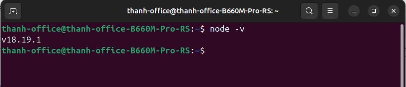
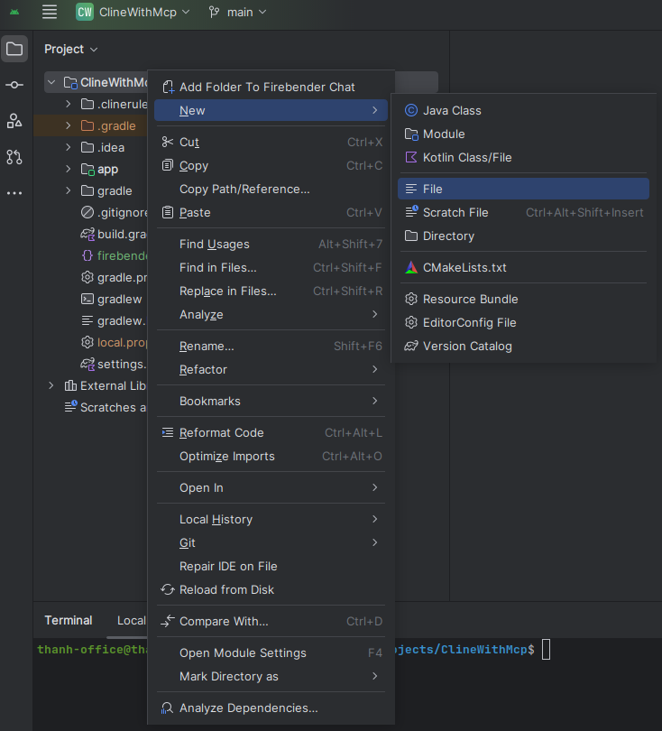
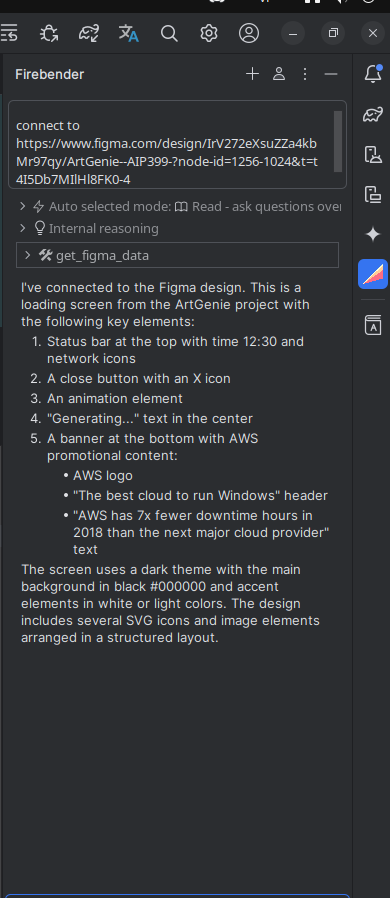

# Hướng dẫn cài đặt

## Bước 1: Cài đặt Node.js

Truy cập [trang chủ Node.js](https://nodejs.org/en/download) để tải và cài đặt Node.js.
Sau khi cài đặt xong, mở terminal và gõ lệnh sau để kiểm tra:

```bash
node -v
```

Nếu cài đặt thành công, sẽ thấy phiên bản Node.js được hiển thị.


## Bước 2: Tạo file cấu hình trong Android Studio

Mở Android Studio, tại thư mục gốc (root) của dự án, tạo một file mới có tên
là [firebender.json](./firebender.json).



```json
{
  "rules": [],
  "mcpServers": {
    "figma": {
      "command": "npx",
      "args": [
        "figma-developer-mcp",
        "--figma-api-key=Truyền key vô đây nhen",
        "--stdio"
      ]
    }
  }
}
```

## Bước 4: Mở quyền Admin và chạy lệnh PowerShell

Để chạy các script PowerShell, bạn cần mở PowerShell với quyền Administrator và thực thi lệnh sau:

```powershell
Set-ExecutionPolicy RemoteSigned
```
## Bước 5: Khởi động lại Android Studio và kiểm tra kết nối Fire Bender

Sau khi hoàn tất các bước cài đặt:

1. Đóng hoàn toàn Android Studio
2. Khởi động lại Android Studio
3. Mở dự án của bạn và truy cập Fire Bender
4. Chạy lệnh kết nối tới Figma bằng cách truyền link Figma vào:

```bash
connect figma://link-tới-file-figma-của-bạn
```

Nếu kết nối thành công, bạn sẽ nhận được thông báo "Success".

```
